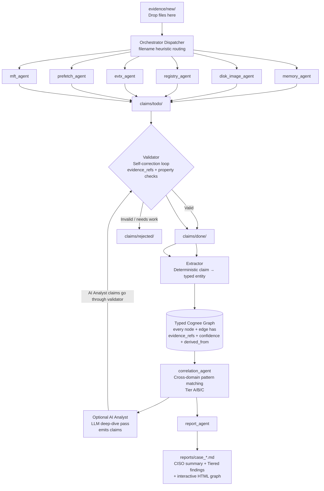

# dfirskills

**Autonomous multi-agent DFIR pipeline for the SANS FIND EVIL! AI Hackathon**

A three-layer DFIR system that ingests Windows memory dumps, disk images (E01), registry hives, event logs, prefetch files, and MFT/USN data. Domain agents emit validated forensic **claims** (Markdown + YAML). A thin orchestrator performs deterministic extraction into a **typed Cognee knowledge graph** with full evidence provenance on every node and edge. Secure tool execution is enforced via a custom path-confined Chisel MCP server with comprehensive audit logging.

Built for the **SANS FIND EVIL! / Protocol SIFT Contest**.

Drop evidence files into evidence/new/ (memory dumps, .E01, hives, .evtx, .pf, $MFT, etc.). The pipeline processes autonomously, settles, and produces a report in reports/.

---

## Key Features & Contest Alignment

- **Architectural guardrails first** — Chisel provides path confinement + tool allowlisting. The validator enforces evidence integrity. No reliance on prompt engineering to prevent spoliation.
- **Self-correction loop** — Claims are validated for real evidence references and property consistency before promotion. Rejected claims trigger re-processing.
- **Typed provenance graph** — Every entity and relationship carries `evidence_refs`, `confidence`, and `derived_from`. Built with Pydantic + Cognee (local Kuzu backend).
- **Domain intelligence via SKILLS.md** — Agents load rich forensic playbooks (triage order, go-deeper signals, cross-source corroboration patterns, confidence rubric).
- **Full audit trail** — Every tool invocation is logged with timestamps, agent, args, exit code, and output summary.
- **Practitioner output** — Tiered Markdown report (CISO summary → Executive Tier A → Domain Tier B → Appendix) + interactive HTML graph + MITRE ATT&CK mapping.
- **SIFT-native** — Runs on stock SANS SIFT Workstation using real tools (Volatility 3, EvtxECmd, MFTECmd, RECmd, pyscca, YARA, The Sleuth Kit, etc.).

---

## What makes this different
**No LLM in the structured-data path.** Forensic logic lives in deterministic Python agents. The graph is written only by a deterministic extractor. The one LLM component (the optional forensic analyst) is downstream of the deterministic baseline and is gated by the same validator everything else passes through — it cannot introduce a finding that contradicts the graph.

**Evidence access is kernel-confined, not prompt-confined.** All tool execution is routed through Chisel, a custom MCP server that confines reads to the evidence root at the OS level and gates every command against an allowlist. An agent physically cannot run a destructive command or read outside the case.

**Every claim self-validates before it counts.** A claim's cited evidence must exist on disk, its asserted attributes must match the graph, and its body text must agree with its frontmatter — or it is rejected, never silently ingested.

**Self-Correction & Validation**
The validator.py implements a self-correction loop:

Every claim’s evidence_refs are checked for existence on disk.
Key properties are spot-checked against the source artifact.
Invalid claims are moved to claims/rejected/ and can trigger re-processing or agent re-evaluation.

This is a core architectural feature (not prompt-based) and will be demonstrated in the contest video.

## Architectural pattern
**Custom MCP Server (Chisel) + deterministic multi-agent pipeline.** The security property is architectural: Chisel enforces a kernel-confined evidence root plus a command allowlist over an MCP shell_exec interface. 

1. The forensic agents are deterministic Python — the LLM is not driving the shell.
2. The orchestrator only dispatches, validates, and routes.
3. A single optional LLM agent (forensic analyst) runs last and is subordinate to the deterministic baseline. 

Three layers, never crossed:

| Layer | Where it lives | Who writes it |
|---|---|---|
| **Evidence** | Local directory — immutable raw files | external (you drop files in) |
| **Claims** | Markdown files with YAML frontmatter | domain agents |
| **Entities** | Cognee graph (typed nodes + edges, every one carrying `evidence_refs`) | orchestrator only — agents never touch Cognee |



The orchestrator dispatches, validates, and routes. All forensic logic lives in the per-domain agents. 

## Audit trail & provenance
Chain-of-custody: the orchestrator hashes every file in evidence/new/ (SHA-256) before any agent touches it and re-verifies at the end of the run. A modified or missing source file flips the process exit code regardless of report success.

Every forensic-tool invocation is routed through Chisel's exec_tool() and logged to evidence/audit/chisel_exec_<YYYYMMDD>.jsonl — one append-only record per call:

Combined with the evidence_refs carried by every graph node and claim, this answers the judges' core audit question — "trace this finding back to the tool execution that produced it" — with one grep. The Chisel WHITELIST is the single source of truth for which tools an agent may run; adding a tool requires editing both the allowlist and the agent code that calls it.

Some audit limitations exist for certain tools (Will update this section later...ran out of time)

---

## Running a case
 1. Drop evidence into evidence/new/. The dispatcher routes by filename.

 2. MFT / USN journal use staged prefixes so the router can distinguish them:
cp '$MFT'  'evidence/new/__mft__$MFT'
cp '$J'    'evidence/new/__usnjrnl__$J'

2. Run the orchestrator (Chisel must be running in Terminal A)
python -u -m orchestrator.main

3. Read the report
ls reports/case_*.md

## Installation

dfirskills is designed to run end-to-end on a stock **SANS SIFT Workstation** VM (Ubuntu 22.04, x86-64). SIFT ships with Volatility 3, EZ Tools, YARA, The Sleuth Kit, EWF tools, Plaso, and the .NET 6 runtime pre-installed at the paths dfirskills expects. On top of SIFT you install Cognee, this repo, the Python dependencies, and the YARA signature-base.

### 1. Get SIFT Workstation

1. Request the SIFT VM download from <https://www.sans.org/tools/sift-workstation/> 
2. Import the supplied OVA into VMware Workstation/Fusion or VirtualBox. Recommended VM specs: **8 GB RAM, 4 CPU, 100+ GB disk** (E01 images are large).
3. Boot the VM. Default credentials: `sansforensics` / `forensics`. Open a terminal — your home is `/home/sansforensics`.
4. Ensure protocol SIFT is installed
   `curl -fsSL https://raw.githubusercontent.com/teamdfir/protocol-sift/main/install.sh | bash`

### 2. Clone dfirskills 
```bash
git clone https://github.com/patflanigan/dfirskills.git
cd dfirskills


### 3. Python environment + dependencies

```bash
cd ~/dfirskills
sudo apt install python3.12-venv
python3 -m venv .venv
source .venv/bin/activate
pip install -r requirements.txt --break-system-packages

pip install --user volatility3 --break-system-packages
```
I had issues with missing volatility3 for handling raw memory files. this needs to be reviewed. for now i have installed it

This installs **[Cognee](https://github.com/topoteretes/cognee)** — the typed knowledge-graph backend the orchestrator extracts entities into — plus `python-dotenv`, `PyYAML`, `requests`, and the optional `anthropic` SDK (only used if you set `ANTHROPIC_API_KEY` later). Cognee runs entirely on-disk under `evidence/audit/<CASE_ID>/cognee_{system,data}` — no external service or API key required.

### 4. YARA signature-base

The YARA rule base is vendored separately (Detection Rule License 1.1 — kept out of this repo).

```bash
cd ~/dfirskills
sudo apt install yara
git clone https://github.com/Neo23x0/signature-base rules/signature-base
yarac rules/signature-base/yara/*.yar rules/signature-base.compiled
```

### 5. Configure `.env`

```bash
cd ~/dfirskills
cp .env.example .env

# Generate and persist a fresh Chisel bearer-token secret
echo "CHISEL_SECRET=$(openssl rand -hex 24)" >> .env

# Optional: ANTHROPIC_API_KEY enables the LLM-polished CISO summary at the
# top of each case report. Without it the summary still renders with a
# deterministic prose template — genuinely optional.
# echo "ANTHROPIC_API_KEY=sk-ant-..." >> .env
```

If `CHISEL_SECRET` is unset when the orchestrator starts, agents fail fast with a `KeyError` at import time. This is intentional — a missing secret should never silently fall through to a default.

`.env.example` already includes the Cognee defaults that this pipeline depends on — leave them in place unless you know you need otherwise:

- `COGNEE_VECTOR_STORE=local` / `COGNEE_GRAPH_STORE=local` — pin Cognee to on-disk storage (no cloud).
- `SYSTEM_ROOT_DIRECTORY` / `DATA_ROOT_DIRECTORY` are **intentionally not in `.env`** — `orchestrator/main.py` sets them per-case at startup (one isolated graph + vector store per CASE_ID under `evidence/audit/`).

### 6. Smoke check

```bash
# Terminal A — start Chisel, confined to the evidence root
cd ~/dfirskills
./chisel --root "$PWD/" --secret "$(grep ^CHISEL_SECRET .env | cut -d= -f2)"
```

**Watch the `--root` carefully** — it must resolve to `~/dfirskills/evidence. A wrong `--root` causes every forensic-tool call to fail with `security error: resolved path … is outside configured root`.

```bash
# Terminal B — sanity-import the orchestrator
cd ~/dfirskills
source .venv/bin/activate
python -c "import orchestrator.main; print('OK')"
```

You should see the orchestrator import without error and print a `CASE_ID=…` line. You're ready to run a case (see [Running a case](#running-a-case) below).

---

---

### Orchestrator CLI flags

| Flag | Effect |
|---|---|
| *(none)* | One-shot: process all pending evidence, settle (30 s of inactivity), generate report, exit. |
| `--watch` | Watch forever (legacy; no settle-detection, no report). |
| `--quiet-period N` | Seconds of inactivity required to declare the pipeline settled (default 30). |
| `--no-analyst` | Skip the LLM-driven forensic analyst deep-dive pass. Default: analyst runs after plaso. |

### Filename routing

The dispatcher routes by filename heuristic:

| Pattern | Agent |
|---|---|
| `*baseline*` | registered to `evidence/baselines/` (used by memory_agent for diff) |
| `*.E01`, `*.Ex01` | disk_image_agent (mounts + extracts hives → re-queues into `evidence/new/`) |
| `*.evtx`, `__evtx_*` | evtx_agent |
| `__mft__*`, `*$MFT`, `__usnjrnl__*`, `*$J`, `__recycle__*` | mft_agent |
| `*.pf`, `__prefetch__*` | prefetch_agent |
| Registry hives (auto-detected by header) | registry_agent |
| anything else | memory_agent |

---

## Browse the case graph (Cognee html report)

Every run produces html graph under `reports/` and a **typed knowledge graph** under `evidence/audit/<CASE_ID>/cognee_{system,data}` (one isolated graph per case, Kuzu-backed). The report is the executive view; the graph is the analyst's view — every node carries `evidence_refs` back to the raw artifact it was extracted from.


## Project layout
```
.
├── orchestrator/           # Thin dispatcher + validator + extractor  
│   ├── main.py             # CLI entrypoint
│   ├── watcher.py          # Watches evidence/new/ and claims/todo/
│   ├── validator.py        # Self-correction loop (evidence ref + property checks)
│   └── extractor.py        # Deterministic claim → Cognee entity extraction
├── agents/                 # One agent per forensic domain
│   ├── _chisel.py          # Shared MCP-over-HTTP client for Chisel
│   ├── memory_agent/       # Volatility 3: pslist, psscan, malfind, netscan, dlllist
│   ├── disk_image_agent/   # ewfmount + Sleuth Kit hive extraction
│   ├── registry_agent/     # RECmd / AppCompat / Amcache parsing
│   ├── evtx_agent/         # EvtxECmd: security events, logons, service creation
│   ├── prefetch_agent/     # pyscca: execution timeline + last run times
│   ├── mft_agent/          # MFTECmd + RBCmd: file activity + recycle bin
│   ├── correlation_agent/  # Cross-domain pattern matching (Tier A/B/C)
│   └── report_agent/       # Markdown report + MITRE ATT&CK + graph viz
├── cognee_schema/
│   └── schema.py           # Pydantic typed nodes + edges; provenance-required
├── rules/                  # YARA rules (clone signature-base separately — see Setup)
├── evidence/               # Per-case evidence
├── reports/                # Generated case reports
└── SKILLS.md               # Per-domain forensic skill loaded by the agents at runtime
```

---

## Output

Each run produces two artifacts:

**1. Markdown case report** — `reports/case_YYYYMMDD_HHMMSS.md`

- **CISO summary** (one-paragraph plain-English briefing + risk/confidence/next-steps for non-technical leadership)
- Executive summary (Tier-A correlations: cross-domain, ≥0.95 confidence)
- Domain sections (Tier-B: high-confidence single-domain findings)
- Appendix (Tier-C: recurring / lower-confidence)
- MITRE ATT&CK technique mapping
- Graph visualization (`reports/case_graph_*.html`) — interactive, filterable, self-contained HTML

---

## Custom Chisel 
```bash
dfirskills includes a forked custom compiled version of Chisel — Rust-powered MCP server providing path-confined evidence reads.
 -> reference https://github.com/ckanthony/Chisel
/Chisel/chisel-core/src/ops/shell.rs creates command restrictions to the following tools

const WHITELIST: &[&str] = &[
    "grep", "sed", "awk", "find", "cat", "head", "tail", "wc", "sort", "uniq", "cut", "tr", "diff",
    "file", "stat", "ls", "du",
    // ← Your DFIR tools go here
    "log2timeline.py",
	"psort.py",
	"pinfo.py",
	"image_export.py",
	"mactime",
	"fls",
	"ils",
	"icat",
	"istat",
	"ifind",
	"ffind",
	"fsstat",
	"blkcat",
	"blkls",
	"blkstat",
	"blkcalc",
	"mmls",
	"mmstat",
	"mmcat",
	"tsk_recover",
	"sorter",
	"sigfind",
	"jls",
	"jcat",
	"hfind",
	"ewfmount",
	"vshadowmount",
	"bdemount",
	"xmount",
	"imagemounter",
	"mount_ewf.py",
	"qemu-nbd",
	"partprobe",
	"mount",
	"umount",
	"losetup",
	"volatility",
	"vol.py",
	"vol",
	"rekall",
	"dotnet",
	"mftecmd",
	"evtxecmd",
	"recmd",
	"pecmd",
	"amcacheparser",
	"appcompatcacheparser",
	"jlecmd",
	"lecmd",
	"sqlecmd",
	"srumecmd",
	"vtecmd",
	"rbcmd",
	"bstrings",
	"rip.pl",
	"regripper",
	"bulk_extractor",
	"foremost",
	"photorec",
	"scalpel",
	"strings",
	"floss",
	"tshark",
	"tcpdump",
	"ngrep",
	"tcpxtract",
	"exiftool",
	"yara",
	"clamscan",
	"hayabusa",
	"md5sum",
	"sha1sum",
	"sha256sum",
	"sha512sum",
	"ssdeep",
	"md5deep",
	"echo",
	"printf",
	"ls",
	"cat",
	"grep",
	"rg",
	"find",
	"file",
	"stat",
	"hexdump",
	"xxd",
	"head",
	"tail",
	"less",
	"awk",
	"sed",
	"sort",
	"uniq",
	"wc",
        "yara",
        "yarac",
        "fusermount",
];

```

To build Chisel from source instead: `git clone https://github.com/ckanthony/Chisel.git 
add the above allow lists
&& cd Chisel && cargo build --release && cp target/release/chisel /path/to/dfirskills/`.


## MIT License

Released under the MIT License. See [`LICENSE`](./LICENSE).
